# Natura.lk

## 🌟 Overview

Natura.lk is an e-commerce platform developed as a university group project. It provides a platform for users to browse and purchase products online, with features such as user authentication, product listings, shopping cart, and checkout.

---

## ✨ Key Features

*   User Authentication with Firebase
*   Product Listings and Details
*   Shopping Cart Functionality
*   Checkout Process
*   Admin Panel for managing products, customers, and orders
*   Customer support chat

---

## 🛠️ Technology Stack

*   **Frontend:** HTML, CSS, JavaScript, Tailwind
*   **Backend:** PHP
*   **Database:** MySQL
*   **APIs/Services:** Firebase Authentication
*   **Development Tools:** VS Code, Git
*   **Deployment:** WAMP (local)

---

## 🚀 Getting Started

### Prerequisites

*   WAMP Server
*   PHP
*   MySQL
*   Firebase Account

### Installation & Setup

1.  Clone the repository:
    ```bash
    git clone https://github.com/ama-23-ops/Natura.lk_website-UniversityProject.git
    ```
2.  Navigate to the project directory:
    ```bash
    cd Natura.lk_website-UniversityProject
    ```
3.  Import the database:
    *   Create a MySQL database.
    *   Import the `db.sql` file into the database.
4.  Set up Firebase:
    *   Create a Firebase project.
    *   Enable Firebase Authentication.
    *   Update the Firebase configuration in `firebase/config.txt` and `firebase/firebase-config.js` with your Firebase project credentials.
5.  Configure the database connection:
    *   Update the database credentials in `db.php` with your MySQL database credentials.

### Running the Application

*   Start the WAMP server.
*   Open your browser and navigate to the project directory (e.g., `http://localhost/Natura.lk`).

---

## 💡 Project Structure

project-root/
├── admin/ # Admin panel files
├── assets/ # CSS, JS, Images
├── blogs/ # Blog related files
├── customer/ # Customer related files
├── firebase/ # Firebase configuration files
├── includes/ # Include files
├── uploads/ # Product images
├── .gitattributes
├── .gitignore
├── about.php
├── add_user.php
├── cart.php
├── chat.php
├── check_session.php
├── collections.php
├── contact.php
├── db.php
├── db.sql
├── faqs.php
├── firebase_auth_check.php
├── home.php
├── index.php
├── login.php
├── logout.php
├── package-lock.json
├── package.json
├── privacy-policy.php
├── product_details.php
├── products.php
├── register.php
├── reset_password.php
├── search.php
├── tailwind.config.js
├── update_verification_status.php
└── verification.php

---

## 🎯 Learning & Challenges

This project was a significant step in my web development journey.As the frontend developer on this project, I significantly enhanced my skills in PHP and JavaScript for building the user interface and client-side interactions. While my primary focus was client-side, I gained valuable insight into how backend services like Firebase are integrated for features such as user authentication and dynamic data display.Tackling various frontend-specific challenges also improved my problem-solving abilities and time management.This project also provided valuable experience in teamwork and communication within a development environment.

---

## 🤝 Contribution

*   **My Role:** Frontend Developer
*   **Key Contributions:**
    *   Designed and developed the user interface (UI) and user experience (UX) for key application sections, including the [Homepage, Product Listing Pages, Product Detail Pages, and Cart/Checkout flow].
    *   Translated UI/UX designs and wireframes into responsive and interactive web pages, ensuring cross-browser compatibility and a consistent experience on various devices (desktop, tablet, mobile).
    *Collaborated with the backend team to integrate frontend components with Firebase services for user authentication and data presentation (e.g., displaying user profiles, product information retrieved from the backend).
    *Actively participated in debugging and resolving frontend bugs to enhance application stability and improve the overall user experience.

---

## 📸 Screenshots

| Feature/Screen                   | Screenshot                                                                  |
| -------------------------------- | --------------------------------------------------------------------------- |
| Homepage Design                  | 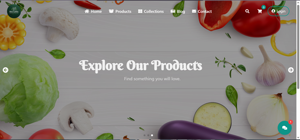                            |
| Collections Page                 | 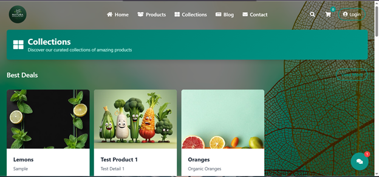                           |
| Products Page                    | 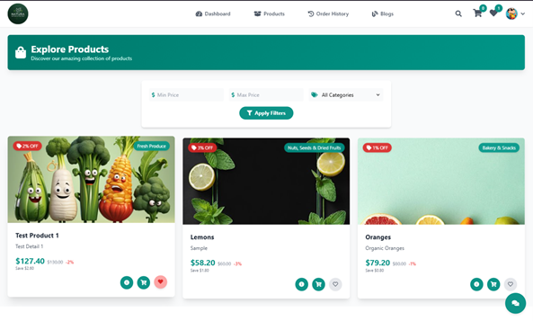                              |
| Product Details Page             | 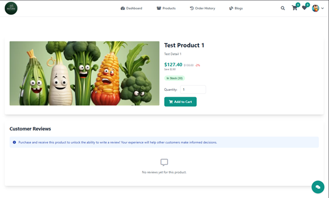                       |
| Cart Page                        | 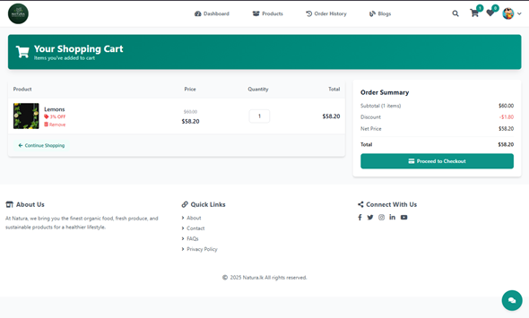                                  |
| Checkout Page                    | 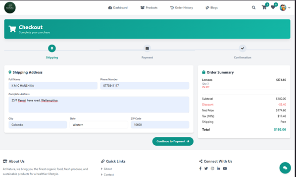                              |
| Payment Details Page             | 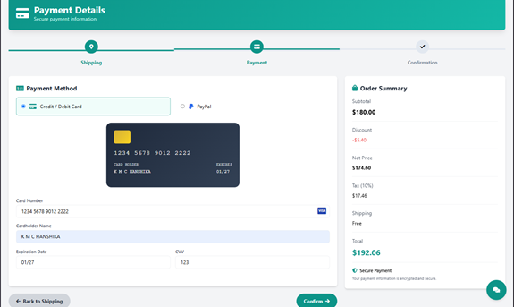                       |
| Order Summary Page               | 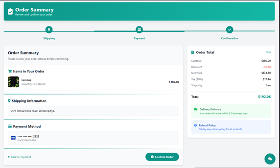                         |
| Contacts Page                    | 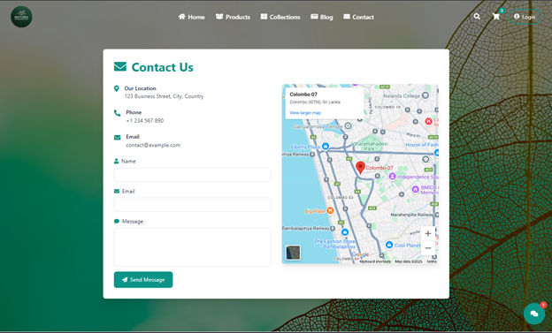                              |
| About Us Page                    | 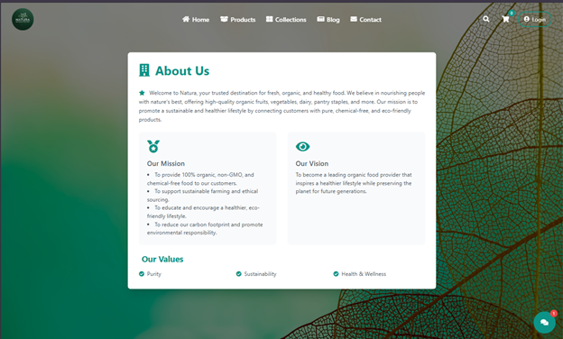                             |
| Blog Page                        | 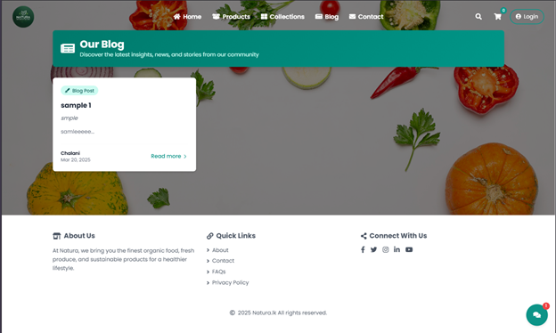                                 |
| User Login/Signup via Firebase   | 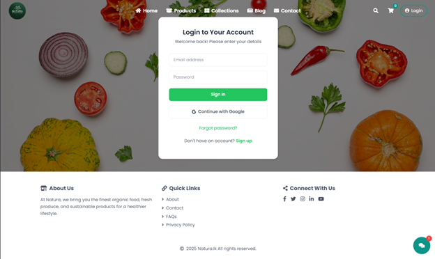            |
| E-mail verification Page         | 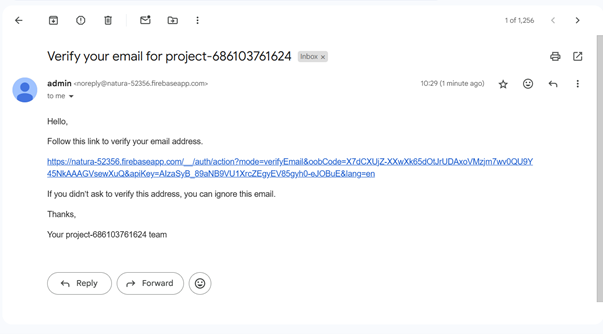                  |
| Customer Profile Page            | 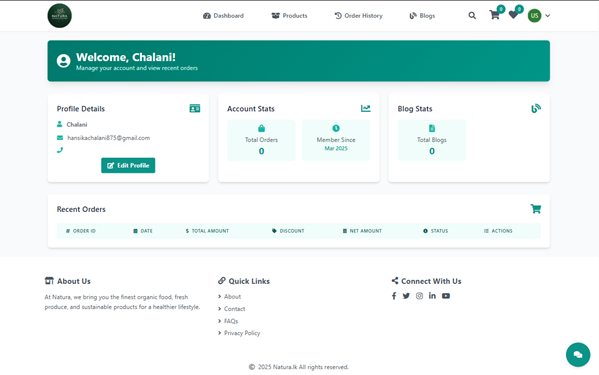                     |
| Whishlist Page                   | 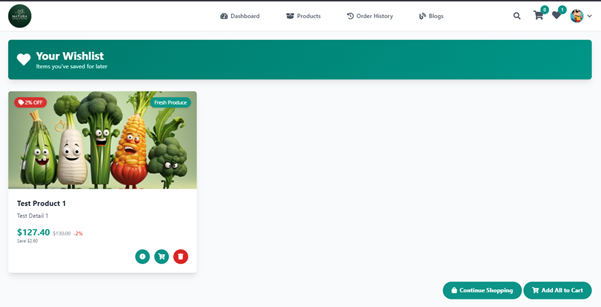                            |
| Online Chat Page                 | 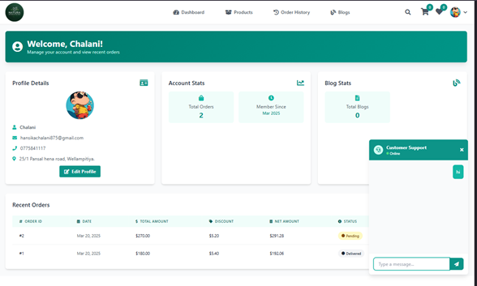                          |
| Customer Blog Page               | 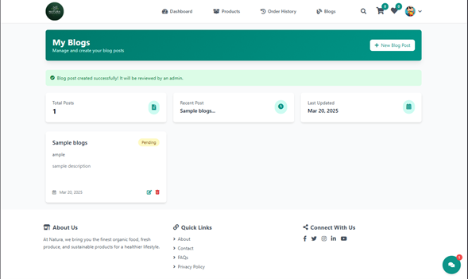                        |
| Admin Dashboard Page             | 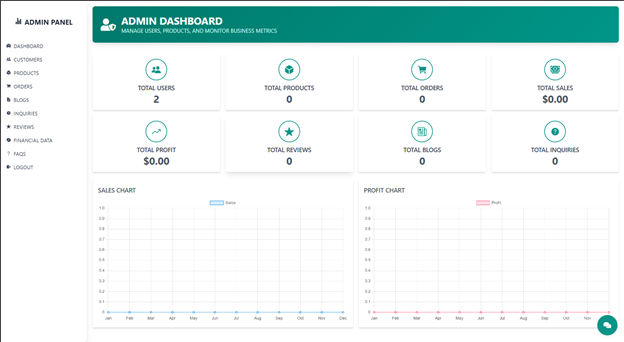                      |

---

## 📜 License

This project is licensed under the MIT License - see the [LICENSE.md](LICENSE.md) file for details.

---
